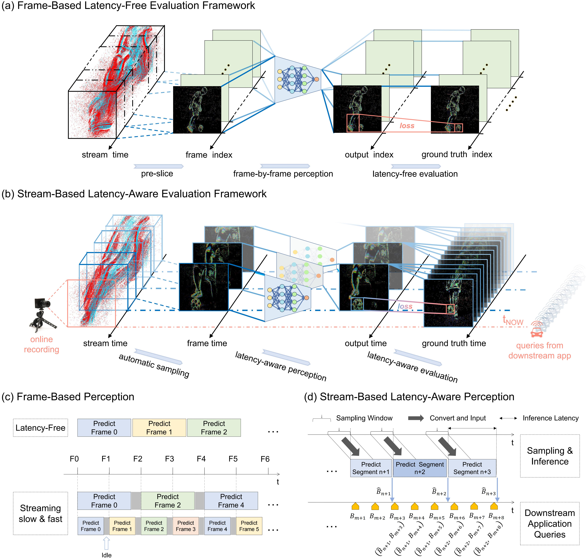

# Bridging the Latency Gap with a Continuous Stream Evaluation Framework in Event-Driven Perception

<!-- TABLE OF CONTENTS -->
<!-- <details open="open" style='padding: 10px; border-radius:5px 30px 30px 5px; border-style: solid; border-width: 1px;'> -->
  <!-- <summary>Table of Contents</summary> -->
  <ol>
    <!-- <li>
      <a href="#introduction">Introduction</a>
    </li> -->
    <!-- <li>
      <a href="#dataset">Dataset</a>
    </li> -->
    <!-- <li>
      <a href="#benchmark">Benchmark</a>
    </li> -->
    <!-- <li>
      <a href="#citation">Citation</a>
    </li> -->
    <!-- <li>
      <a href="#license">License</a>
    </li> -->
  </ol>
<!-- </details> -->

Neuromorphic vision systems, inspired by biological sensory processing, offer transformative potential for real-time applications by leveraging event-driven data streams. However, current evaluation paradigms remain limited by frame-based methodologies that segment continuous event streams and neglect computational latency, which is a critical factor in dynamic, real-world environments. This discrepancy creates a substantial gap between laboratory benchmarks and practical performance, especially in scenarios requiring instantaneous responses. We introduce a novel latency-aware evaluation framework that eliminates the pre-slicing of event stream segmentation and employs continuous, adaptive sampling to preserve temporal continuity while quantifying computational delay. To validate our approach, we create a high-frequency dataset with 500 Hz temporal resolution, capturing scenarios from static to high-speed motion without aliasing. Experiments demonstrate that conventional metrics overestimate real-time performance by up to 40%, underscoring the necessity of latency-aware assessment. We further propose two bio-inspired strategies, predictive motion extrapolation and context-aware sampling, which could leverage the temporal dynamics and motion sensitivity of event streams to reduce latency-induced errors by 59% while boosting inference speed by 12\%. These advances bridge offline evaluation and real-world deployment, offering tools for designing neuromorphic systems in robotics and autonomous applications where sub-millisecond responsiveness is paramount. Our work establishes a foundation for continuous, latency-aware perception, combining methodological innovation with practical impact for next-generation vision technologies.


<br>

## STARE

Please refer to the paper for more details.

<p align="center">
  
</p>


<br>

## Dataset
We present ESOT500, a new dataset for event-based VOT, featuring time-aligned and high-frequency annotations, designed to support STARE’s stringent real-time criteria.


<p align="center">
  
</p>

<br>

#### ESOT500 Structure
```
|-- ESOT500    
    |-- aedat4
    |   |-- sequence_name1.aedat4
    |   |-- sequence_name2.aedat4
    |   :   :
    |
    |-- anno_t
    |   |-- sequence_name1.txt
    |   |-- sequence_name2.txt
    |   :   :
    |
    |-- test.txt
    |-- train.txt
    |-- test_additional.txt
    |-- train_additional.txt
    |-- test_challenging.txt
```

<br>

#### Download

- Download **ESOT500** from our [[Hugging Face]](https://huggingface.co/datasets/NoRealBlank/ESOT500/tree/main) datasets repository. The compressed dataset file is about 13.4 GB in size, and downloading it at a speed of 3 MB/s is expected to take approximately 1.5 hours.

- The aedat4 directory contains the raw event data (event stream and corresponding RGB frames), the [DV](https://inivation.gitlab.io/dv/dv-docs/docs/getting-started.html) and [dv-python](https://gitlab.com/inivation/dv/dv-python) is recommended for visualization and processing in python respectively.

- You can find the metadata file at `data/esot500_metadata.json`, or download it from our dataset page in [[Hugging face]](https://huggingface.co/datasets/NoRealBlank/ESOT500).

<br>

#### Pre-Slice

The pre-slicing process is only for the traditional frame-based latency-free evaluation.
 
```
python PATH_TO\STARE\lib\event_utils\event_stream_pre_slice.py DIR_PATH_TO_AEDAT4_FILES DIR_PATH_WHERE_TO_SAVE_THE_RESULTS FPS MS
```
the arguments `FPS` and `MS` should follow the chart bellow, as shown in the Table. 2 of the paper:

<center>

#### Pre-Slicing Settings (fps/ms)
| 500/2 | 250/2 | 20/2 | 500/50 | 250/50 | 20/50 | 500/100 | 250/100 | 20/100 | 500/150 | 250/150 | 20/150 |
|----|----|---|---|---|--|---|---|---|----|---|--|

</center>

<br>

## Tracker Enhancement

Please refer to the paper for more details.

<br>

## Benchmark
The key advantages of the proposed stream-based latency-aware evaluation are three-fold:
- A unified evaluation regardless of the adopted event representations;
- Dynamic process depending on time rather than frame-sequential;
- Comprehensive evaluation of trackers in terms of latency and accuracy;

Different from frame sequence, event streams are asynchronous data flows. 
As shown below, the major difference between stream-based evaluation and frame-based streaming perception is that there is **input at any time** instead of at certain moments.

<p align="center">
  
  <br> <!-- Break line to ensure caption appears directly below the image -->
  <em> Experimental results: 
  (a) Comparison of the frame-based latency-free evaluation results (-F) and STARE results (-S). 
  (b) The performance of the perception model in STARE decreases as inference speed reduces, as demonstrated by our hardware simulator. The horizontal axis represents the multiple by which the perception model's inference speed is set relative to its normal speed. 
  (c) STARE results (AUC) on ESOT500 with HDETrack. "Auto" means that the perception algorithm is scheduled to automatically sample events as input during online perception, leveraging the continuity of the event stream. "Pre" means that the event stream is pre-sliced into fixed-rate frame sequences (20 fps, as commonly used in traditional evaluations) for latency-free perception. The evaluation stage, however, remains latency-aware, consistent with the original STARE setup.
  (d) STARE results (AUC) on ESOT500, implemented using an RTX3090 with a Ryzen 3960X CPU (left), an RTX3080Ti with an Intel Xeon Silver 4214R CPU (middle), and also an RTX3080Ti with an Intel Xeon Silver 4214R CPU but with each tracking task running in parallel with a DiMP18 task on the same GPU (right). Perception models automatically sample events with various window sizes (ms). "*" indicates finetuned on ESOT500. </em>
</p>

<br>

## Usage
The code is based on the [**PyTracking**](https://github.com/visionml/pytracking) and other similar frameworks.

- **System Requirements**

  ---

  The code is compatible with *Linux* systems equipped with *NVIDIA* GPUs.
  The software versions of the base experimental environment used for testing are:
  - Ubuntu 20.04
  - Python 3.8
  - CUDA 11.3
  - PyTorch 1.10.0
 
  For more detailed information about Python dependencies, their versions, and other details, please refer to the exported requirement file [lib/stare_conda_env.yml](lib/stare_conda_env.yml).

  ---


- **Trackers under PyTracking:**

  ---

  **1.** Go to the working directory of pytracking.
  ```
  cd lib/pytracking
  ```

  ---

  **2.** Create a virtual environment and install required libraries.
  ```
  conda create -n STARE python=3.8
  conda activate STARE
  pip/conda install ...
  ```
  Our code is mainly built based on PyTracking, and you can refer to [lib/pytracking/INSTALL.md](lib/pytracking/INSTALL.md) for detailed installation and configuration.
  
  You can also use the requirement file [lib/stare_conda_env.yml](lib/stare_conda_env.yml) we exported to build the environment.
  ```
  conda env create -f ../stare_conda_env.yml --verbose
  conda activate STARE
  ```
  The entire installation process takes about 0.5h to 1h, depending on the network environment.
  
  ---

  **3.** Preprare the dataset.
  ```
  ln -s /PATH/TO/ESOT500 ../data/EventSOT500
  ```

  ---

  **4.** Set environment for pytracking.
  ```
  python -c "from pytracking.evaluation.environment import create_default_local_file; create_default_local_file()"
  python -c "from ltr.admin.environment import create_default_local_file; create_default_local_file()"
  ```

  ---

  **5.** Modify the dataset path in generated environment setting files.
  - for training: `ltr/admin/local.py`
  - for testing: `pytracking/evaluation/local.py`

  ---

  **6.** Run frame-based evaluation. 
  (Experiment settings are in folder `pytracking/experiments` and `pytracking/stream_settings`)
  ```
  python pytracking/run_experiment.py myexperiments esot500_offline
  ```

  ---

  **7.** Run stream-based evaluation. (Experiment settings are in folder `pytracking/experiments` and `pytracking/stream_settings`.)
  ```
  python pytracking/run_experiment_streaming.py exp_streaming streaming_34
  python eval/streaming_eval_v3.py exp_streaming streaming_34
  ```
  The instructions given are for real-time testing on your own hardware. 
  If you want to reproduce the results in our paper, please refer to `pytracking/stream_settings/s14`.

  ---

  **8.** The results are by default in the folders `pytracking/output/tracking_results` and `pytracking/output/tracking_results_rt_final`. 
  You can change the paths by modifying the `local.py` files.

  ---

  **9.** To evaluate the results, use `pytracking/analysis/stream_eval.ipynb`. 
  You can also refer to it to write the analysis scripts of your own style.

  ---

  **Note:** For tracker enhancement, please see the follow-up section.

  ---

- **Trackers under other frameworks:**

  These trackers use a similar framework to PyTracking, but are not fully integrated into it. 
  Here we take **OSTrack** and **pred_OSTrack** as examples to illustrate the usage, including that of the enhancement.

  ---

  **1.** Go to the working directory.
  ```
  cd lib/sotas/[OSTrack or pred_OSTrack]
  ```

  ---

  **2.** Activate the virtual environment.
  ```
  conda activate STARE
  ```

  ---

  **3.** Install the missing libraries.
  ```
  pip/conda install ...
  ```
  In fact, if you have PyTracking installed, you can directly find and install the missing packages according to the error by running the subsequent scripts.
  Only a few dependencies are different, and it takes a few minutes to install.

  ---

  **4.** Set environment for the tracker.
  ```
  python -c "from lib.test.evaluation.environment import create_default_local_file; create_default_local_file()"
  python -c "from lib.train.admin.environment import create_default_local_file; create_default_local_file()"
  ```

  ---

  **5.** Modify the dataset path in generated environment setting files.
  - for training: `lib/train/admin/local.py`
  - for testing: `lib/test/evaluation/local.py`

  ---

  **6.** Run frame-based evaluation. 
  ```
  python tracking/test.py ostrack baseline --dataset_name esot_500_2
  ```
  **Note:** 
  - This doesn't work for **pred_OSTrack**.
  - The available `dataset_name` can refer to the experiment results listed in our paper.

  ---

  **7.** Run stream-based evaluation **without predictive module**.
  ```
  python tracking/test_streaming.py ostrack esot500_baseline s14 --dataset_name esot500s [--use_aas]
  python ../../pytracking/eval/streaming_eval_v3.py --experiment_module exp_streaming --experiment_name streaming_sotas_ostrack_std
  ```
  **Note:**
  - `--use_aas` option is currently only available to **OSTrack** and **pred_OSTrack**.
  - You can refer to `streaming_sotas_ostrack_std` to add test module of your own style at `../../pytracking/pytracking/experiments/exp_streaming.py`.

  ---

  **8.** Run stream-based evaluation **with predictive module**.
  ```
  python tracking/test_streaming.py ostrack pred_esot500_4step s14 --dataset_name esot500s --pred_next 1 [--use_aas]
  python ../../pytracking/eval/streaming_predspeed.py 
  ```
  **Note:**
  - `--pred_next 1` option is currently only available to **pred_OSTrack**.
  - You can change the relevant parameters in `streaming_predspeed.py` to make it fit your own style.

  ---

  **9.** The results are by default in the folders `pytracking/output/tracking_results` and `pytracking/output/tracking_results_rt_final`. 
  You can change the paths by modifying `local.py` and `streaming_predspeed.py` separately.

  ---

  **10.** Evaluate the results.
  ```
  python tracking/analysis_results_pred.py 
  ``` 
  You can also refer to it to write the analysis scripts of your own style.

  ---

  <br>

## Support

**If you encounter any issues while using our code or dataset, please feel free to contact us.**

<br>


<!-- ## Citation -->

## License
- The released code is under [GPL-3.0 license](https://www.gnu.org/licenses/gpl-3.0.en.html) following the PyTracking.
- The released dataset is under [CC-BY 4.0 license](https://creativecommons.org/licenses/by/4.0/).

<br>

## Acknowledgments
- The benchmark is built on top of the great [PyTracking](https://github.com/visionml/pytracking) library.
- Thanks for the great works including [Stark](https://github.com/researchmm/Stark), [MixFormer](https://github.com/MCG-NJU/MixFormer), [OSTrack](https://github.com/botaoye/OSTrack) and [Event-tracking](https://github.com/ZHU-Zhiyu/Event-tracking).

<br>
