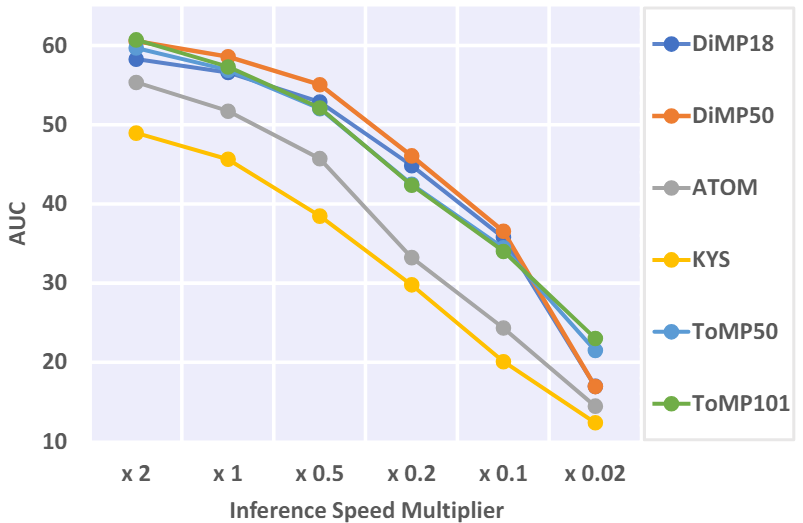

# From Frame to Stream: Rethinking Visual Object Tracking Based on Event Streams

<!-- TABLE OF CONTENTS -->
<!-- <details open="open" style='padding: 10px; border-radius:5px 30px 30px 5px; border-style: solid; border-width: 1px;'> -->
  <!-- <summary>Table of Contents</summary> -->
  <ol>
    <!-- <li>
      <a href="#introduction">Introduction</a>
    </li> -->
    <!-- <li>
      <a href="#dataset">Dataset</a>
    </li> -->
    <!-- <li>
      <a href="#benchmark">Benchmark</a>
    </li> -->
    <!-- <li>
      <a href="#citation">Citation</a>
    </li> -->
    <!-- <li>
      <a href="#license">License</a>
    </li> -->
  </ol>
<!-- </details> -->

## Introduction
In this work, we have 3 contributions:
1. STream-based lAtency-awaRe Evaluation (STARE): A new tracker performance evaluation framework. STARE can reveal tracker's realistic performance by simulating real-world scenarios where downstream applications will ceaselessly request the tracker for current object position without waiting for any inference latency.
2. ESOT500: A new dataset for event-based VOT, featuring time-aligned and
high-frequency (500Hz) annotations. ESOT500 is designed to support STARE’s stringent real-time criteria.
3. Two straightforward yet effective tracker performace enhancement methods: Predictive Tracking & Adaptive Sampling Strategy.

<br><br>

## STARE

Please refer to the paper for more details.

<p align="center">
  
</p>


<br><br>

## Dataset
We present ESOT500, a new dataset for event-based VOT, featuring time-aligned and high-frequency annotations, designed to support STARE’s stringent real-time criteria.


<p align="center">
  
</p>

| Dataset   | #Videos (train/val) | #Annotations | Modality      | Frequency | Time-aligned Annotation | Non-rigid & Outdoor |
|---|---|---|---|---|---|---|
| EED | 5     | 199   | Gray, Event   | 23    | ✓      | ✗   |
| EV-IMO| 3/3    | 76.8K    | Gray, Event   | 200   | ✓       | ✗   |
| FE24ohz| 71/25  | 1132K   | Gray, Event   | 240  | ✗     | ✗   |
| VisEvent| 377/172  | 371K   | RGB, Event    | ~25  | ✗    | ✗   |
| COESOT| 827/527  | 478K | RGB, Event  | ~25  | ✗   | ✓   |
| ESOT500| 146/56    | 1219K  | RGB, Event  | 500   | ✓     | ✓     |

<br>

#### ESOT500 Structure
```
|-- ESOT500    
    |-- aedat4
    |   |-- sequence_name1.aedat4
    |   |-- sequence_name2.aedat4
    |   :   :
    |
    |-- annot
    |   |-- sequence_name1.txt
    |   |-- sequence_name2.txt
    |   :   :
    |
    |-- test.txt
    |-- train.txt
    |-- test_additional.txt
    |-- train_additional.txt
    |-- test_challenging.txt
```

<br>

#### Download

- Download **ESOT500** from [[OneDrive]](https://tongjieducn-my.sharepoint.com/personal/2131522_tongji_edu_cn/_layouts/15/onedrive.aspx?ga=1&id=%2Fpersonal%2F2131522%5Ftongji%5Fedu%5Fcn%2FDocuments%2FEventSOT%2FEventSOT%2DH).

- Download the **challange sequence** of ESOT500 from [[Google Drive]](https://drive.google.com/drive/folders/1MnbPJGrhZL8kopisFEta9AWhFnA-Lbav?usp=sharing) for testing our tracker enhancement.

- The aedat4 directory contains the raw event data (event stream and corresponding RGB frames), the [DV](https://inivation.gitlab.io/dv/dv-docs/docs/getting-started.html) and [dv-python](https://gitlab.com/inivation/dv/dv-python) is recommended for visualization and processing in python respectively.

- You can find the metadata file at `data/esot500_metadata.json`, or download it from our dataset page in [[Hugging face]](https://huggingface.co/datasets/NoRealBlank/ESOT500).

<br>

#### Pre-Slice

The pre-slicing process is only for the traditional frame-based latency-free evaluation.
 
```
python PATH_TO\STARE\lib\event_utils\event_stream_pre_slice.py DIR_PATH_TO_AEDAT4_FILES DIR_PATH_WHERE_TO_SAVE_THE_RESULTS FPS MS
```
the arguments `FPS` and `MS` should follow the chart bellow, as shown in the Table. 2 of the paper:

<center>

#### Pre-Slicing Settings (fps/ms)
| 500/2 | 250/2 | 20/2 | 500/50 | 250/50 | 20/50 | 500/100 | 250/100 | 20/100 | 500/150 | 250/150 | 20/150 |
|----|----|---|---|---|--|---|---|---|----|---|--|

</center>

<br><br>

## Tracker Enhancement

Please refer to the paper for more details.

<br><br>

## Experiments
The key advantages of the proposed stream-based latency-aware evaluation are three-fold:
- A unified evaluation regardless of the adopted event representations;
- Dynamic process depending on time rather than frame-sequential;
- Comprehensive evaluation of trackers in terms of latency and accuracy;

Different from frame sequence, event streams are asynchronous data flows. 
As shown below, the major difference between stream-based evaluation and frame-based streaming perception is that there is **input at any time** instead of at certain moments.

<p align="center">
  
  <br> <!-- Break line to ensure caption appears directly below the image -->
  <em>Tracker performance in STARE across varying output speeds. The x1 denotes the tracker’s actual output speed on our hardware, while other multipliers on the row axis represent the forced multiplication of tracker output speed in our simulated runs. As the output speed decreases, there is a corresponding decline in tracker performance.</em>
</p>

<p align="center">
  
  <br> <!-- Break line to ensure caption appears directly below the image -->
  <em>: Comparison of the frame-based offline evaluation results (-F) and STARE results (-S) for
six representative trackers. A general tracker performance decline from offline to online and a unimodal distribution pattern of tracker performance
across the temporal axis can be observed.</em>
</p>

<br><br>

## Usage
The code is based on the [**PyTracking**](https://github.com/visionml/pytracking) and other similar frameworks.

- **Trackers under PyTracking:**

  ---

  **1.** Go to the working directory of pytracking.
  ```
  cd lib/pytracking
  ```

  ---

  **2.** Create a virtual environment.
  ```
  conda creat -n STARE
  conda activate STARE
  ```
  ---

  **3.** Install required libraries following PyTracking. 
  (Please refer to [lib/pytracking/INSTALL.md](lib/pytracking/INSTALL.md) for detailed installation and configuration.)
  ```
  pip/conda install ...
  ```

  ---

  **4.** Preprare the dataset.
  ```
  ln -s /PATH/TO/ESOT500 ../data/EventSOT500
  ```

  ---

  **5.** Set environment for pytracking.
  ```
  python -c "from pytracking.evaluation.environment import create_default_local_file; create_default_local_file()"
  python -c "from ltr.admin.environment import create_default_local_file; create_default_local_file()"
  ```

  ---

  **6.** Modify the dataset path in generated environment setting files.
  - for training: `ltr/admin/local.py`
  - for testing: `pytracking/evaluation/local.py`

  ---

  **7.** Run frame-based evaluation. 
  (Experiment settings are in folder `pytracking/experiments` and `pytracking/stream_settings`)
  ```
  python pytracking/run_experiment.py myexperiments esot500_offline
  ```

  ---

  **8.** Run stream-based evaluation. (Experiment settings are in folder `pytracking/experiments` and `pytracking/stream_settings`.)
  ```
  python pytracking/run_experiment_streaming.py exp_streaming streaming_34
  python eval/streaming_eval_v3.py exp_streaming streaming_34
  ```
  The instructions given are for real-time testing on your own hardware. 
  If you want to reproduce the results in our paper, please refer to `pytracking/stream_settings/s14`.

  ---

  **9.** The results are by default in the folders `pytracking/output/tracking_results` and `pytracking/output/tracking_results_rt_final`. 
  You can change the paths by modifying the `local.py` files.

  ---

  **10.** To evaluate the results, use `pytracking/analysis/stream_eval.ipynb`. 
  You can also refer to it to write the analysis scripts of your own style.

  ---

  **Note:** For tracker enhancement, please see the follow-up section.

  ---

- **Trackers under other frameworks:**

  These trackers use a similar framework to PyTracking, but are not fully integrated into it. 
  Here we take **OSTrack** and **pred_OSTrack** as examples to illustrate the usage, including that of the enhancement.

  ---

  **1.** Go to the working directory.
  ```
  cd lib/sotas/[OSTrack or pred_OSTrack]
  ```

  ---

  **2.** Activate the virtual environment.
  ```
  conda activate STARE
  ```

  ---

  **3.** Install the missing libraries.
  ```
  pip/conda install ...
  ```
  In fact, if you have PyTracking installed, you can directly find and install the missing packages according to the error by running the subsequent scripts. 

  ---

  **4.** Set environment for the tracker.
  ```
  python -c "from lib.test.evaluation.environment import create_default_local_file; create_default_local_file()"
  python -c "from lib.train.admin.environment import create_default_local_file; create_default_local_file()"
  ```

  ---

  **5.** Modify the dataset path in generated environment setting files.
  - for training: `lib/train/admin/local.py`
  - for testing: `lib/test/evaluation/local.py`

  ---

  **6.** Run frame-based evaluation. 
  ```
  python tracking/test.py ostrack baseline --dataset_name esot_500_2
  ```
  **Note:** 
  - This doesn't work for **pred_OSTrack**.
  - The available `dataset_name` can refer to the experiment results listed in our paper.

  ---

  **7.** Run stream-based evaluation **without predictive module**.
  ```
  python tracking/test_streaming.py ostrack esot500_baseline s14 --dataset_name esot500s [--use_aas]
  python ../../pytracking/eval/streaming_eval_v3.py --experiment_module exp_streaming --experiment_name streaming_sotas_ostrack_std
  ```
  **Note:**
  - `--use_aas` option is currently only available to **OSTrack** and **pred_OSTrack**.
  - You can refer to `streaming_sotas_ostrack_std` to add test module of your own style at `../../pytracking/pytracking/experiments/exp_streaming.py`.

  ---

  **8.** Run stream-based evaluation **with predictive module**.
  ```
  python tracking/test_streaming.py ostrack pred_esot500_4step s14 --dataset_name esot500s --pred_next 1 [--use_aas]
  python ../../pytracking/eval/streaming_predspeed.py 
  ```
  **Note:**
  - `--pred_next 1` option is currently only available to **pred_OSTrack**.
  - You can change the relevant parameters in `streaming_predspeed.py` to make it fit your own style.

  ---

  **9.** The results are by default in the folders `pytracking/output/tracking_results` and `pytracking/output/tracking_results_rt_final`. 
  You can change the paths by modifying `local.py` and `streaming_predspeed.py` separately.

  ---

  **10.** Evaluate the results.
  ```
  python tracking/analysis_results_pred.py 
  ``` 
  You can also refer to it to write the analysis scripts of your own style.

  ---


## Support

**If you encounter any issues while using our code or dataset, please feel free to contact us.**


<!-- ## Citation -->

## License
- The released code is under [GPL-3.0 license](https://www.gnu.org/licenses/gpl-3.0.en.html) following the PyTracking.
- The released dataset is under [CC-BY 4.0 license](https://creativecommons.org/licenses/by/4.0/).

## Acknowledgments
- The benchmark is built on top of the great [PyTracking](https://github.com/visionml/pytracking) library.
- Thanks for the great works including [Stark](https://github.com/researchmm/Stark), [MixFormer](https://github.com/MCG-NJU/MixFormer), [OSTrack](https://github.com/botaoye/OSTrack) and [Event-tracking](https://github.com/ZHU-Zhiyu/Event-tracking).
